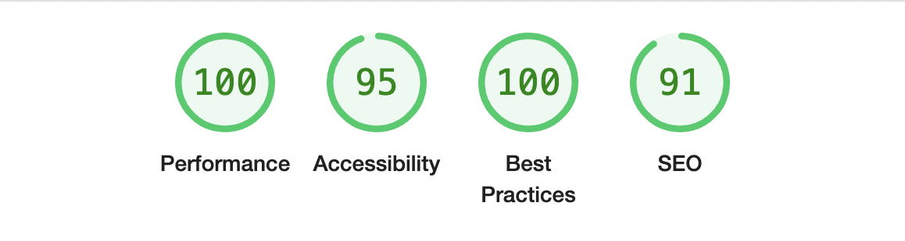

# Developer Portfolio

Welcome to my developer portfolio! This project showcases my skills, projects, and experience as a Full-stack developer/ Software Engineer. The portfolio is built with the Next.js framework and styled with Tailwind CSS.

## Features

- **Responsive Design**: Optimized for various devices and screen sizes.
- **Projects Showcase**: Detailed information about the projects I have worked on.
- **Skills Section**: Highlighting my technical skills and expertise.

## Technologies Used

- [Next.js](https://nextjs.org/): A React framework for production.
- [Tailwind CSS](https://tailwindcss.com/): A utility-first CSS framework for rapid UI development.

## Lighthouse Score



## Getting Started

To get a local copy up and running follow these simple steps.

### Prerequisites

Make sure you have [Node.js](https://nodejs.org/) and npm installed on your machine.

### Installation

1. **Clone the repo**
   ```sh
   git clone https://github.com/yourusername/your-repo-name.git
   ```
2. **Install dependencies**
   ```sh
   npm i
   ```
3. **Run locally**
   ```sh
   npm run dev
   ```
### Show your support
Make sure to leave a  &#9733; if you liked the project.
